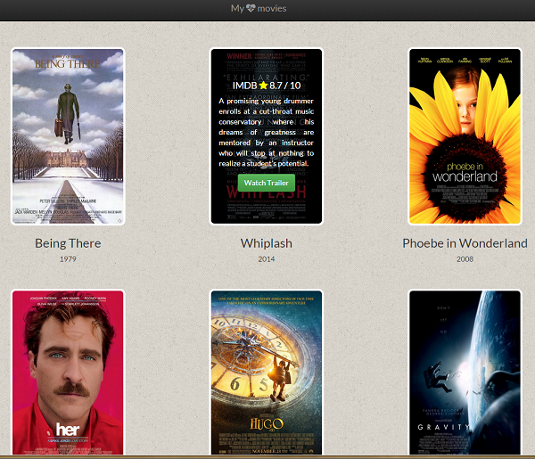

My fav movies
===
##### Server-side code which stores a list of my favourite movies and serves them as a web-page

How to run it
* Install Python 2.7
* download the project folder on your computer
* From cmd/terminal, navigate to the project folder and run `python entertainement_center.py`

